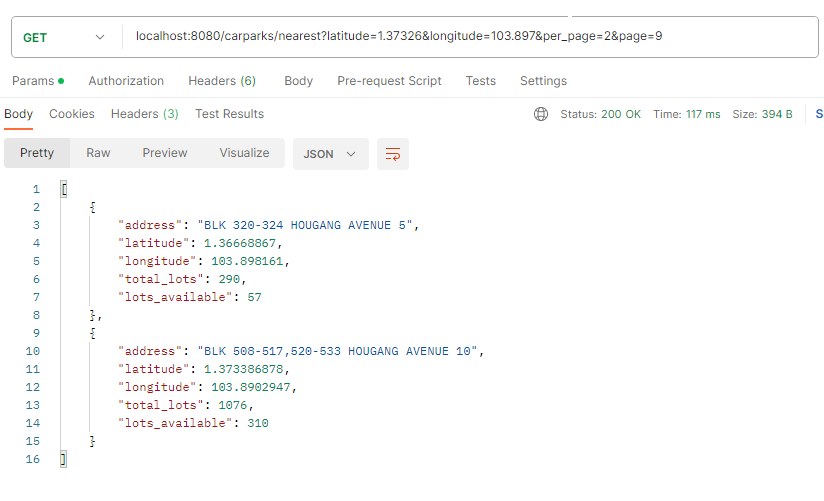

### Carpark Availability Project

## Description

This project helps you find the closest parking lot and tells you how many parking spaces are there and how many are currently vacant.

## Prerequisites

- Java JDK
- Spring Boot
- PostgreSQL
- Maven
- Docker

## DATABASE DESIGN AND API

We have two tables: `carpark` for storing parking availability data and `location` for storing detailed information about each parking facility, including its latitude and longitude. You can refer to the diagram below for a visual representation:


Each `carpark` is associated with exactly one `location`, and this relationship is established through a one-to-one connection. The `location` table includes a `carpark_location_id` column, which serves as a foreign key referencing the `id` column in the `location` table.


The following screenshots show you how to test the APIs using Postman.

__1. Input Carpark Location `POST /input-location`__

We initially store static carpark location data from this [source](https://beta.data.gov.sg/collections/148/view) into our `location` table. The data from this source is in SVY21 format, which we convert to a more commonly used format using an online converter. After the conversion process, we insert the converted file into the database. This process allows us to readily query the `location` table when calculating distances based on latitude and longitude. To efficiently handle large datasets, we implement batch insert operations. Leveraging Hibernate as our JPA provider, we configure the batch size in the `application.properties` to optimize the data insertion process. Additionally, to avoid running into memory problems when dealing with many entities, periodically flush and clear the persistence context. This action releases memory and reduces the risk of encountering OutOfMemoryErrors.


`curl --location --request POST 'localhost:8080/carparks/input-location'`

__2. Input Carpark Availability `POST /input-availability`__

This system interacts with an API to retrieve real-time updates on carpark availability. You can find more information about this API [here](https://beta.data.gov.sg/collections/85/view). The data obtained from this API is stored in our `carpark` table, and it can be invoked whenever we need to update carpark availability information within the database.


`curl --location --request POST 'localhost:8080/carparks/input-availability'`

__3. Get Nearest Carpark List `POST /nearest?latitude=1.37326&longitude=103.897&page=1&per_page=3`__

Using the data previously stored in our database, we utilize this API to retrieve information about the nearest carpark, including details on available parking spaces and the carpark's address. To determine the distance, we employ the [Euclidian Distance Formula](https://en.wikipedia.org/wiki/Euclidean_distance), selected for its simplicity and straightforward calculation. This formula provides a direct and intuitive representation of the shortest distance between two points, making it easily interpretable and understandable. We employ native queries in this context to gain finer control over the SQL query execution.



`curl --location 'localhost:8080/carparks/nearest?latitude=1.37326&longitude=103.897&per_page=2&page=6'`

## Steps to Setup

__1. Clone the repository__


__2. Configure PostgreSQL__

First, create a database named postgres. Then, open src/main/resources/application.properties file and change the spring datasource username and password as per your PostgreSQL installation.

__3. Run the app__

Type the following command from the root directory of the project to run it -

`mvn clean spring-boot:run`

If you have docker installed, use this command to run the app:
```
mvn clean package
```
```
docker-compose up
```

The application will start on the default port 8080.

Note: Please ensure that you first call the `Input Carpark Location` API before making a request to the `Input Carpark Availability` API.